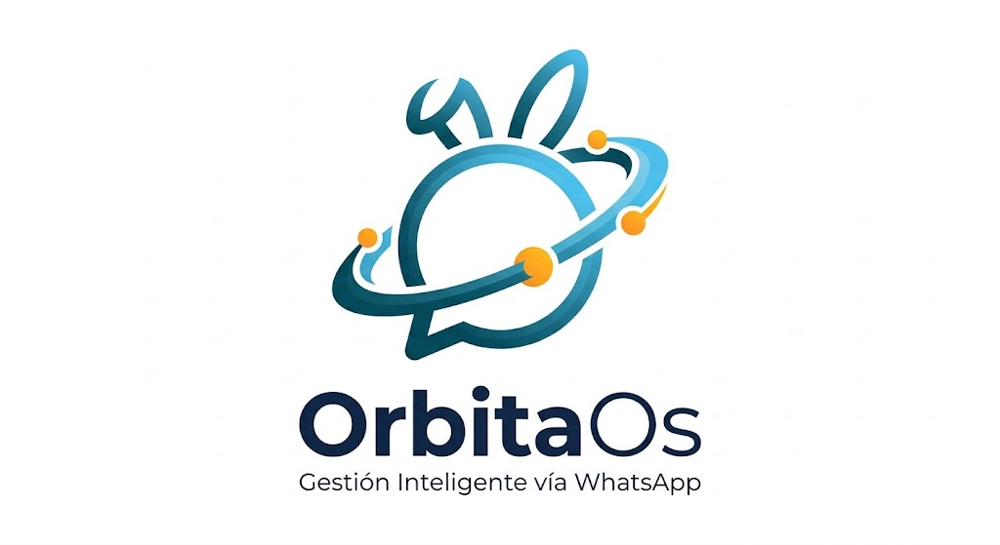

# 🚀 OrbitaOs



> Asistente personal y gestión de operaciones por WhatsApp.

OrbitaOs atiende desde WhatsApp: agenda citas con recordatorios, administra tareas
en un tablero Kanban, redacta documentos y responde consultas usando un modelo de
lenguaje. Todo queda registrado en MongoDB y corre en Docker.

> **Repositorios.** Este repositorio (`FUDAPY/OrbitaOs_Server`) está preparado
> para un servidor dedicado, preferentemente desplegado sobre **Dokploy**. Si el
> objetivo es correr OrbitaOs en una máquina local, las instrucciones específicas
> están en [FUDAPY/OrbitaOs_Local](https://github.com/FUDAPY/OrbitaOs_Local).

<div align="center">

### 🛠️ Stack

[](https://nodejs.org)
[](https://wwebjs.js.org)
[](https://www.mongodb.com)
[](https://mongoosejs.com)
[](https://docs.docker.com/compose/)
[](https://traefik.io)
[](https://duckduckgo.com)
[](https://spacebunnymodel.com)
[](LICENSE)

</div>

<div align="center">

### ✨ Funcionalidades

| 📅 Citas | ✅ Tareas | 📄 Documentos |
|:---:|:---:|:---:|
| Recordatorios 24 h y 2 h antes | Tablero Kanban por columnas | Actas, informes y contratos |

| 🔐 Usuarios | 🌐 Búsqueda web | 💰 Control de gasto |
|:---:|:---:|:---:|
| Roles y contraseñas con scrypt | DuckDuckGo, sin API key | Tope diario de llamadas |

</div>

---

## 📑 Contenido

- [Arquitectura](#-arquitectura)
- [Cómo funciona](#-cómo-funciona)
- [Intenciones](#-intenciones)
- [Módulos](#-módulos)
- [Decisiones de diseño](#-decisiones-de-diseño)
- [Variables de entorno](#-variables-de-entorno)
- [NexusOS (POS / ERP / CRM)](#nexusos-pos--erp--crm)
- [Instalación](#-instalación)
- [Despliegue en Dokploy](#-despliegue-en-dokploy)
- [Uso por WhatsApp](#-uso-por-whatsapp)
- [Comandos y CLI](#-comandos-y-cli)
- [API HTTP](#-api-http)
- [Recursos](#-recursos)
- [Pruebas](#-pruebas)
- [Problemas frecuentes](#-problemas-frecuentes)
- [Licencia](#-licencia)

---

## 🏗️ Arquitectura

```
                          📱 WhatsApp
                              │
                    ┌─────────▼──────────┐
                    │  🔐 Lista blanca   │  Solo usuarios autorizados
                    │  (colección User)  │  /agregar   /quitar
                    └─────────┬──────────┘
                              │ mensaje
                    ┌─────────▼──────────┐
                    │   🟢 OrbitaOs Bot   │
                    │  whatsapp-web.js    │  Chromium headless
                    │   + LocalAuth       │  Sesión persistente
                    └─────────┬──────────┘
                              │
        ┌─────────────────────┼─────────────────────┐
        │                     │                     │
┌───────▼────────┐   ┌────────▼─────────┐   ┌─────────▼────────┐
│ 🧠 ai_router   │   │ 🔐 users.js      │   │ 📝 task_flow.js  │
│                │   │                  │   │                  │
│ Space Bunny    │   │ scrypt + roles   │   │ Alta guiada      │
│ Alpha → JSON   │   │ acceso WhatsApp  │   │ sin llamar a la  │
│                │   │                  │   │ IA               │
│ 🌐 DuckDuckGo  │   │                  │   │                  │
│ (tool calling) │   │                  │   │                  │
└───────┬────────┘   └────────┬─────────┘   └─────────┬────────┘
        │                     │                     │
        │              ┌──────▼──────┐              │
        └──────────────►│  🐳 MongoDB │◄─────────────┘
        │              │  4 modelos  │         ┌──────┴───────┐
        │              │  (volumen)  │         │ ⏰ cron_jobs │
        │              └─────────────┘         │ Recordatorios│
        │                                      │  24 h y 2 h  │
        ▼                                      └──────┬───────┘
┌───────────────┐                                     │
│ 🌐 Traefik    │◄────── tu-dominio.com ──────────────┘
│  (proxy HTTPS)│
└───────────────┘
```

### Flujo de un mensaje

```
📩 Mensaje
   │
   ├─▶ 🔐 ¿Tiene acceso? ── NO ──▶ ⛔ Ignorado, sin responder
   │                          SÍ
   ├─▶ 📝 ¿Es alta de tarea? ── SÍ ──▶ Formulario guiado (0 tokens)
   │                                    NO
   ├─▶ 💾 Guardar en MongoDB
   │
   ├─▶ 🧠 Modelo (Space Bunny Alpha)
   │      │
   │      ├─ ¿Necesita internet? ── SÍ ──▶ 🌐 DuckDuckGo → vuelve al modelo
   │      │
   │      └─◀ JSON: { intent, response_text, data }
   │
   ├─▶ ⚙️ Ejecutar: agendar / tarea / documento / chat
   │
   └─▶ 📤 Responder por WhatsApp
```

### Control de acceso

La lista blanca **es la colección `User`**: cualquier usuario con `phone` y
`allowed = true` puede escribir. Los números que no estén ahí se descartan en
silencio, sin respuesta ni aviso.

```
┌──────────────┐
│ Mensaje      │
└──────┬───────┘
       ▼
┌─────────────────────┐   NO    ┌─────────────────┐
│ ¿Tiene un usuario   │────────►│  Ignorado + log │
│ con allowed=true?   │         │ (no se responde)│
└──────┬──────────────┘         └─────────────────┘
       │ SÍ
       ▼
┌─────────────────┐
│ Procesar con IA │
└─────────────────┘
```

---


## ⚙️ Cómo funciona

1. **Recibe** el mensaje por WhatsApp Web (Chromium headless dentro del contenedor).
2. **Valida** el acceso contra la colección `User`.
3. **Revisa** si hay un formulario de tarea abierto: si lo hay, el mensaje es una
   respuesta del formulario y se resuelve sin llamar al modelo.
4. **Enruta** el texto a Space Bunny Alpha con un system prompt que obliga a
   devolver JSON: `{ intent, response_text, data }`.
5. **Ejecuta** la acción según la intención.
6. **Persiste** mensaje, intención y datos en MongoDB.
7. **Responde** en el mismo chat.

En paralelo, un cron corre cada minuto y dispara los recordatorios de los
eventos que entran en la ventana de 24 h o de 2 h.

### 🎯 Intenciones

| Intención | Qué hace | Campos que espera |
|---|---|---|
| `chat` | Conversación libre | `{}` |
| `schedule_event` | Agenda un evento | `title`, `start_at`, `location` |
| `create_document` | Genera un documento | `type`, `title`, `content`, `format` |
| `add_task` | Crea una tarea | `assignee`, `title`, `priority`, `due_at` |
| `update_task` | Actualiza una tarea | `task_id`, `status` |
| `adjust_stock` | Carga o descuenta stock en el POS (NexusOS) | `producto`, `cantidad`, `modo`, `sucursal` |

### Sin clave de IA, el sistema sigue andando

Si `SPACE_BUNNY_API_KEY` está vacía, el enrutador entra en **modo local**: un
conjunto de reglas por expresión regular detecta la intención y arma la
respuesta. La misma vía se usa como reserva cuando la API falla o se alcanza el
tope diario de llamadas. En ningún caso el bot deja de responder.

### Mensajes de datos faltantes

Cuando un `schedule_event` o un `add_task` viene incompleto, el backend impone
un texto fijo en lugar de dejar que el modelo improvise:

```
Para agendar, por favor indícame:
📅 Fecha
⏰ Hora
📝 Qué cosa (motivo)
📍 Dónde
```

```
Para crear la tarea necesito:
👤 Para quién
✅ Qué tarea
🔥 Prioridad
⏳ Fecha límite
```

El modelo recibe esa instrucción en el prompt, pero la verificación final la
hace el backend sobre `data`: si falta la fecha o el asignado, se reemplaza
`response_text` por el mensaje oficial y se marca `faltan_datos`, con lo cual no
se ejecuta ninguna acción. Así el usuario ve siempre la misma estructura,
sin importar qué devuelva el modelo.

---

## 🧩 Módulos

```
orbitaos/
├── index.js               Orquestador: WhatsApp, acceso, persistencia y acciones
├── src/
│   ├── ai_router.js       Enrutado de intenciones + normalización de fechas
│   ├── task_flow.js       Formulario guiado de alta de tareas
│   ├── web_search.js      Búsqueda web con DuckDuckGo
│   ├── users.js           Usuarios, contraseñas y control de acceso
│   ├── database.js        Conexión y esquemas Mongoose
│   ├── cron_jobs.js       Recordatorios de 24 h y 2 h
│   └── health_server.js   Chequeo de vida por HTTP
├── Dockerfile
├── docker-compose.yml
├── docker-entrypoint.sh
├── .env.example
└── scripts/               CLI y pruebas
```

| Módulo | Responsabilidad |
|---|---|
| `index.js` | Levanta WhatsApp, valida el acceso, persiste mensajes, despacha la acción y apaga en orden. |
| `src/ai_router.js` | Envía el system prompt, ejecuta herramientas, parsea el JSON y normaliza fechas. |
| `src/task_flow.js` | Recoge los datos de una tarea de a un mensaje, sin llamar al modelo. |
| `src/web_search.js` | Busca en DuckDuckGo con tres fuentes en cascada. |
| `src/users.js` | CRUD de usuarios con scrypt, bootstrap del primer owner, lista blanca. |
| `src/database.js` | Esquemas `User`, `Message`, `Event` y `Task` con sus índices. |
| `src/cron_jobs.js` | Ventanas de 24 h y 2 h, envío del aviso y marcado. |
| `src/health_server.js` | Responde `/health` y `/` en el puerto 3000. |

### Modelos de datos

**👤 User** — identidad y acceso
`username` · `passwordHash` *(scrypt)* · `name` · `phone` · `role` · `allowed` · `timezone` · `lastSeenAt`

**💬 Message** — bitácora
`chatId` · `from` · `to` · `direction` · `body` · `intent` · `data` · `fallback`

**📅 Event** — cita con recordatorios
`title` · `startAt` · `endAt` · `location` · `status` · `reminders.h24` · `reminders.h2`

**✅ Task** — tarea del tablero
`title` · `status` *(backlog · todo · in_progress · review · done)* · `priority` · `dueAt` · `position` · `labels`

### Motor de recordatorios

```
   Evento agendado
         │
         ▼
   ┌─────────────┐
   │  24 h antes │──► 📤 "Recordatorio 24 horas"
   └──────┬──────┘
          ▼
   ┌─────────────┐
   │  2 h antes  │──► 📤 "Recordatorio 2 horas"
   └─────────────┘

✅ Cada hito se marca como enviado: nunca se repite.
🛡 Ventana de ±10 min: un reinicio no pierde el aviso.
🔒 Actualización condicionada: sin duplicados con varias réplicas.
```

La ventana de tolerancia existe porque el cron corre **cada minuto**: comparar
contra un instante exacto haría que un reinicio justo en ese minuto pierda el
aviso para siempre. Con ±10 minutos el evento se captura igual y se marca una
sola vez.

---


## 🧠 Decisiones de diseño

Esta sección reúne los problemas técnicos que planteó el proyecto y cómo
quedaron resueltos. Son la parte menos evidente del código, así que conviene
tenerlas presentes antes de tocar nada.

### Fechas: el modelo no devuelve ISO de forma confiable

Space Bunny Alpha no entrega una fecha normalizada. Según cómo el usuario
escriba la petición, cambia el campo **y** el formato:

| El usuario escribe | Campo devuelto | Valor |
|---|---|---|
| "mañana a las 15:00" | `date` + `time` | `"tomorrow"` · `"15:00"` |
| "el 12/09/2026 a las 10:30" | `date` + `time` | `"2026-09-12"` · `"10:30"` |
| "12/09/2026 a las 10:30" | `date` + `time` | `"12 de septiembre de 2026"` |
| "3 de octubre a las 18:00" | `date` + `time` | `"3 de octubre"` · `"18:00"` |
| "2026-10-05T14:00:00Z" | `start` | ISO completo |

`resolveEventDate()` en `src/ai_router.js` recorre esos formatos y devuelve un
`Date`. Sin esa capa, leer `data.start_at` directamente daba `null` en la mayoría
de los casos y **ninguna cita se agendaba**, sin error visible: el bot respondía
"listo" y no guardaba nada.

El mismo parser se reutiliza en `task_flow.js` para interpretar "mañana" o "el
12/09" durante el formulario, sin gastar tokens.

### Chromium: el perfil queda bloqueado entre despliegues

`LocalAuth` usa `<SESSION_PATH>/session-<clientId>` como `userDataDir`, y ese
directorio vive en un volumen persistente. Cuando el contenedor se corta,
Chromium deja atrás:

```
SingletonLock, SingletonSocket, SingletonCookie
```

`SingletonLock` es un **symlink** que apunta al hostname y PID del proceso
anterior. Como ese proceso ya no existe, el symlink queda roto, y para un
symlink roto `fs.existsSync()` devuelve `false`: el archivo está pero reporta
inexistente. Por eso el chequeo tiene que listar el directorio con
`readdirSync()` y borrar con `unlinkSync()`, que sí funciona sobre symlinks
rotos.

El síntoma es este error al arrancar:

```
The profile appears to be in use by another Chromium process (19) on another computer
Can't open display:  →  Failed to launch the browser process: Code: 21
```

**Dos contramedidas:**

1. `index.js` borra los locks al arrancar y, si el arranque vuelve a fallar,
   reconstruye el perfil y reintenta una vez.
2. `docker-entrypoint.sh` los borra antes de bajar privilegios.

### Permisos del volumen: root escribe, node no puede

`chown -R node:node /app` se ejecuta en el **build**, pero el volumen se monta
en **runtime** y Docker lo crea como `root`. El proceso corre como `node`, así
que no podía borrar un lock creado por root y el contenedor entraba en un loop de
reinicios.

La solución es un entrypoint que arranca como `root`, corrige el ownership y
después baja privilegios con `gosu`:

```
dumb-init (PID 1) → docker-entrypoint.sh (root) → gosu node → node index.js
```

Por eso el `Dockerfile` **no** lleva `USER node` y el compose **no** declara
`user:`: cualquiera de los dos impediría el `chown`.

### Tool calling: dos llamadas, no una

La búsqueda web exige dos llamadas al modelo:

```
1ª llamada ── tools: [buscar_en_web]   ← sin forzar JSON
      ├─ responde directo ──────────► fin (una sola llamada)
      └─ devuelve tool_calls
                │
                ▼
          DuckDuckGo (Node.js)
                │
                ▼
2ª llamada ── system prompt + JSON estricto
```

`tools` y `response_format` son excluyentes en el protocolo: si se fuerza el
formato JSON en la primera llamada, el modelo no puede pedir una herramienta. Por
eso la primera va libre y solo la segunda exige JSON.

Si la búsqueda falla, el error se inyecta al modelo con rol `tool` para que lo
comente en la respuesta en vez de inventar datos.

### Headless en contenedores

`headless: true` está deprecado y con versiones nuevas de Chromium puede
arrancar en modo con display, provocando `Can't open display`. Se usa
`headless: 'new'` más los flags habituales: `--no-sandbox`,
`--disable-setuid-sandbox` y `--disable-dev-shm-usage`.

El compose define además `shm_size: "1gb"`, porque los 64 MB por defecto de
`/dev/shm` no alcanzan para Chromium.

### DuckDuckGo no tiene API estable

`duckduckgo-search` devuelve un objeto vacío: DuckDuckGo rechaza el scraping
automatizado. `api.duckduckgo.com` solo responde a consultas de conocimiento
concreto y devuelve vacío para búsquedas genéricas.

`src/web_search.js` cascadea tres fuentes:

1. `html.duckduckgo.com` parseando el HTML — **la que funciona** de forma
   consistente.
2. `api.duckduckgo.com` como refuerzo.
3. La librería, como último recurso.

Si las tres fallan se devuelve el error, para que el modelo lo diga. El bloqueo
es más frecuente desde IPs de proveedores en la nube; si en un entorno concreto
no devuelve nunca resultados, la alternativa es un buscador con plan gratuito.

### Formulario de tareas sin modelo

Preguntar "¿para quién es?" y volver a llamar al modelo por cada dato costaría
varias llamadas por tarea. `task_flow.js` recorre los campos con reglas locales
y solo escribe en la base al final. La detección previa de intención ("necesito
una tarea...") también es una expresión regular, así que abrir el formulario no
consume tokens.

El flujo vive en memoria y caduca a los 15 minutos de inactividad.

También arranca solo: si el mensaje dice *"necesito una tarea urgente..."* o
*"crear una tarea para Ana"*, se abre el formulario sin gastar tokens.

### Permisos y sesiones

- `passwordHash` usa **scrypt** de la librería nativa de Node, con salt
  aleatorio por usuario y comparación en tiempo constante.
- El campo tiene `select: false`: no aparece en listados ni en logs.
- No se puede eliminar al último `owner`; sin esa protección el sistema podría
  quedar sin nadie capaz de administrar usuarios.
- `WHITELIST` es opcional. El acceso real vive en la base de datos, y los
  números del entorno se dan de alta como usuarios al arrancar.

### Zona horaria

`TZ` se define en los dos servicios (bot y MongoDB). Sin esto el contenedor
corre en UTC y tanto las fechas interpretadas como los cron se desplazan
respecto de la hora local.

### Puertos y proxy inverso

El servicio **no publica puertos en el host**: expone `3000` y deja que Traefik
llegue por la red interna de Docker. Publicar un puerto abre conflictos con el
resto de aplicaciones del servidor y además expone el chequeo de salud a internet
sin TLS. El servicio tiene que estar en la red compartida `traefik` para que el
proxy lo alcance.

---

## 🔧 Variables de entorno

Se parte de `.env.example` como base. Las que no tienen valor por defecto son las
únicas que hay que completar para que el sistema funcione.

### Esenciales

| Variable | Para qué |
|---|---|
| `MONGO_URI` | Cadena de conexión. Dentro de compose: `mongodb://mongo:27017/orbitaos` |
| `ADMIN_USERNAME` | Usuario `owner` inicial (por defecto `thesadboypy`) |
| `ADMIN_PASSWORD` | Contraseña del usuario inicial (por defecto `741963`) |
| `BOT_PHONE` | Número que se vincula al bot, con prefijo de país |
| `SPACE_BUNNY_API_KEY` | Clave del modelo. Sin ella el bot funciona igual, en modo local |
| `TZ` | Zona horaria del negocio |

### Accesos

| Variable | Por defecto | Para qué |
|---|---|---|
| `ADMIN_PHONE` | — | Teléfono del administrador |
| `ADMIN_WHITELIST` | — | Números que administran la lista blanca desde WhatsApp |
| `WHITELIST` | vacío | Números con acceso. Opcional: el acceso real está en la base |
| `GROUP_PREFIX` | vacío | Prefijo para que el bot conteste en grupos |

> **Estar en `WHITELIST` no crea ninguna cuenta.** Solo marca el número como
> permitido. Para que alguien tenga ficha hay que crearla en el panel
> (Usuarios), con `/agregar`, o con `npm run user -- create`. Si un número de
> la lista no tiene ficha, el bot lo avisa por log al arrancar y no lo deja
> escribir: **no se dan de alta usuarios automáticamente**.

### Modelo

| Variable | Por defecto | Para qué |
|---|---|---|
| `SPACE_BUNNY_API_URL` | endpoint oficial | URL de la API |
| `SPACE_BUNNY_MODEL` | `space-bunny-alpha` | Nombre del modelo |
| `SPACE_BUNNY_TEMPERATURE` | `0.2` | Creatividad. Más bajo = más predecible |
| `SPACE_BUNNY_MAX_TOKENS` | `4096` | Límite de tokens de respuesta |
| `SPACE_BUNNY_TIMEOUT_MS` | `60000` | Tiempo máximo de espera |
| `AI_CONTEXT_MESSAGES` | `8` | Mensajes de contexto. Bajarlo abarata cada llamada |
| `SPACE_BUNNY_DAILY_CAP` | `0` | Tope diario de llamadas. `0` = sin límite |
| `WEB_SEARCH_ENABLED` | `true` | Habilita la herramienta `buscar_en_web` |

### NexusOS (POS / ERP / CRM)

Integración con el sistema de ventas: consultar y cargar stock desde WhatsApp.
**Todo es opcional**: sin estas variables el bot funciona igual, solo pierde la
carga de stock.

| Variable | Por defecto | Para qué |
|---|---|---|
| `NEXUS_API_URL` | — | Base del API **con** el prefijo: `https://host/api/v1` |
| `NEXUS_SERVICE_TOKEN` | — | **Secreto.** Token de servicio. Viaja en el header `x-service-token` |
| `NEXUS_SUCURSALES` | — | Sucursales válidas, separadas por coma |
| `NEXUS_TIMEOUT_MS` | `10000` | Espera máxima de una llamada |

> ⚠️ **Las cuatro tienen que estar también en `docker-compose.yml`.** Dokploy no
> inyecta las variables del Environment en el contenedor por su cuenta: si no
> están referenciadas con `${...}` en el `environment:` del servicio, el bot no
> llega a NexusOS aunque el panel las tenga cargadas.

El token **nunca** se escribe en el código, en un log ni en un mensaje de
respuesta: solo en el entorno. `src/nexus_client.js` expone `enmascarar()` para
poder depurar sin exponerlo.

#### Sucursales

`NEXUS_SUCURSALES` lista los valores **exactos** que usa NexusOS en
`products.sucursal`. Las mayúsculas y los espacios importan: el bot compara
contra esa lista y no envía nunca un valor inventado.

El usuario puede escribirla de cualquier forma; el bot la resuelve:

| Dice el usuario | Se envía |
|---|---|
| `san benito`, `san benito cafe` | `San Benito Cafe Resto Bar` |
| `chicolin`, `cafeteria`, `la cafeteria` | `CAFETERIA CHICOLIN` |

Si **no** la menciona, el bot pregunta cuál antes de confirmar. No elige una
por defecto: cargar en la sucursal equivocada descuadra el inventario y no se
detecta hasta el conteo.

#### Cómo se aplica una carga

```
"CARGAR EN STOCK PILSEN 1 LT - 6 UNIDADES"
   → ¿en qué sucursal?  [1] San Benito Cafe Resto Bar  [2] CAFETERIA CHICOLIN
   → "1"
   → 📦 Confirmá la carga de stock
      PILSEN 1 LT · 6 · agregar · San Benito Cafe Resto Bar
   → "dale"
   → ✅ Stock actualizado: 24 → 30
```

Nunca se escribe a partir de texto libre: primero se resuelve el producto
contra el catálogo real, después se muestra el resumen y se espera un "sí".
Si el producto no existe o hay varios parecidos, el bot pregunta en vez de
elegir el primero.

Cada carga lleva un `Idempotency-Key` propio, generado una vez por operación.
Si el mismo mensaje se procesa dos veces, NexusOS lo detecta y devuelve
`replayed: true`: el bot avisa "ya estaba cargado" y **no** suma de nuevo.

### Sesión de WhatsApp

| Variable | Por defecto | Para qué |
|---|---|---|
| `BOT_PHONE` | — | Número con prefijo de país. Habilita el emparejamiento por código |
| `SESSION_PATH` | `/app/session` | Carpeta de sesión. Debe estar en un volumen |
| `CHROME_PATH` | `/usr/bin/chromium` | Ruta del navegador |

### Recordatorios y dominio

| Variable | Por defecto | Para qué |
|---|---|---|
| `CRON_REMINDERS` | `*/1 * * * *` | Frecuencia del motor |
| `CRON_TZ` | `America/Asuncion` | Zona horaria del cron |
| `REMINDER_TOLERANCE_MINUTES` | `10` | Ventana de tolerancia a cada hito |
| `REMINDER_TIMEZONE` | `America/Asuncion` | Zona de los textos enviados |
| `PORT` | `3000` | Puerto interno del servidor de salud |

El dominio no se configura por entorno: se define en la pestaña **Domains** de
Dokploy, que gestiona el proxy y el certificado.

---

## 📥 Instalación

### Opción A — Docker Compose

```bash
git clone https://github.com/FUDAPY/OrbitaOs_Server.git
cd OrbitaOs_Server
cp .env.example .env
```

Una vez completadas las variables esenciales en `.env`, el servicio se levanta con:

```bash
docker compose up -d --build
```

### Opción B — Local

Requiere Node.js 20 o superior y un MongoDB accesible. Las instrucciones
completas para entorno local (variables, sesión y pruebas) están en
[FUDAPY/OrbitaOs_Local](https://github.com/FUDAPY/OrbitaOs_Local); este
repositorio está pensado para un servidor dedicado, preferentemente sobre
Dokploy.

```bash
npm install
cp .env.example .env      # MONGO_URI apuntando a tu base
npm start
```

En local la sesión de Chromium se guarda en `./session`. Para probar conviene
usar un número que no sea el personal.

---

## 🚀 Despliegue en Dokploy

**1 · Publicación del código**

```bash
git add .
git commit -m "OrbitaOs"
git push origin main
```

**2 · Creación del recurso**

```
New Resource  →  Compose
├─ Repository:    FUDAPY/OrbitaOs_Server
├─ Branch:        main
├─ Compose Path:  /docker-compose.yml
└─ Build Type:    Dockerfile
```

**3 · Carga de las variables**

En la pestaña **Environment**:

```env
TZ=America/Asuncion
BOT_PHONE=<numero_internacional_sin_mas>

ADMIN_USERNAME=<usuario>
ADMIN_PASSWORD=<clave_larga_y_unica>
ADMIN_PHONE=<numero_internacional_sin_mas>
ADMIN_WHITELIST=<numero_internacional_sin_mas>

SPACE_BUNNY_API_KEY=<clave_de_la_API>
```

> Las credenciales se leen del entorno, nunca del código. Cambiarlas después es
> `npm run user -- pass <usuario> <nueva>`.

**4 · Despliegue**

El servicio `mongo` tiene healthcheck y el bot espera a que esté sano. El build
incluye Chromium, que es la parte más larga.

**5 · Vincular WhatsApp**

Definir `BOT_PHONE` y revisar los logs del servicio:

```
================================================================
  CODIGO DE EMPAREJAMIENTO: A1B2C3D4
================================================================
  [actual: A1B2C3D4]
  [también en la web: GET /  ->  "codigo_vinculacion"]
```

En el celular, en la app de WhatsApp:
**☰ ≡ → Dispositivos vinculados → Vincular con número de teléfono** →
ingresar el código.

> **El código cambia cada ~3 minutos.** Es WhatsApp quien los renueva, no el
> bot. Si el que se tiene a mano ya venció, ingresarlo no hace nada: WhatsApp
> cierra el intento sin decir por qué.
>
> Para no buscarlo en los logs, **basta con abrir la URL del servicio y
> recargarla**: el código vigente aparece en el campo `codigo_vinculacion`.
>
> ```bash
> curl -s https://tu-dominio/ | grep codigo_vinculacion
> ```

La alternativa es escanear el QR de los logs, que solo es práctica desde una
terminal con monitor: en un panel web la trama de caracteres no es legible por
la cámara.

> **La sesión vive en el volumen `session-data`.** Mientras no se borre, cada
> redespliego mantiene el vínculo.

<details>
<summary>Número de WhatsApp para el bot</summary>

`whatsapp-web.js` automatiza un WhatsApp común, no la API Oficial de Business.
Conviene un número dedicado: uno nuevo, una línea fija o de VoIP, o una SIM
secundaria.

Si se vincula el número personal, el bot y los chats privados conviven en la
misma aplicación y WhatsApp suele terminar la sesión por comportamiento
automatizado.

</details>

**6 · Dar de alta los contactos**

Desde el chat con el bot, sin depender de una terminal:

| Comando | Qué hace |
|---|---|
| `/agregar 595981234567 Ana` | Autoriza a un contacto |
| `/quitar 595981234567` | Revoca el acceso |
| `/contactos` | Lista los autorizados |

Solo funcionan para números de `ADMIN_WHITELIST` o con rol `owner`/`admin`. Los
cambios se aplican al instante: no hace falta redesplegar.

---

## 📱 Uso por WhatsApp

### Comandos

| Comando | Qué hace |
|---|---|
| `/help` | Ayuda y ejemplos |
| `/agenda` | Próximas citas |
| `/tareas` | Estado del tablero |
| `/tarea` | Alta guiada de una tarea |
| `/estado` | Diagnóstico y consumo del día |
| `/contactos` | Lista blanca |
| `/agregar` · `/quitar` | Altas y bajas de la lista blanca |

### Ejemplos

**Agendar citas**

```
> Agenda una reunión con el equipo el 12/09 a las 15:00
> Necesito llamar al cliente mañana a las 10:00
> Agendame el stand-up diario a las 9:00
```

Si faltan datos, el bot responde con la estructura fija:

```
Para agendar, por favor indícame:
📅 Fecha
⏰ Hora
📝 Qué cosa (motivo)
📍 Dónde
```

**Crear tareas**

Con `/tarea` el bot va preguntando de a un mensaje, sin llamar al modelo:

```
/tarea
Bot: 📝 ¿Qué tarea es?

Llamar al proveedor
Bot: 👤 ¿Para quién es?

Ana
Bot: 🗓 ¿Para cuándo?

el 12/09
Bot: 🚦 ¿Qué prioridad?

alta
Bot: 📋 Revisemos
     • Tarea: Llamar al proveedor
     • Asignada a: Ana
     • Vence: sábado 12/09
     • Prioridad: high
     Respondé "listo" para guardarla.

listo
Bot: ✅ Tarea creada · Llamar al proveedor
```

En cualquier paso: `x` usa el valor por defecto, `saltar` crea la tarea ya y
`cancelar` aborta. El flujo caduca a los 15 minutos.

**Actualizar tareas**

```
> Completar la tarea de llamar al proveedor
> Marcar la factura como en progreso
> Cambiar la prioridad de la presentación a urgente
```

**Documentos**

```
> Redacta un acta de la reunión de ayer
> Generá un informe de ventas del último trimestre
> Redacta un contrato entre el proveedor y la empresa
```

**Stock del POS (NexusOS)**

```
> Cargar en stock Pilsen 1 LT, 6 unidades, en chicolin

Bot: 📦 Confirmá la carga de stock
     Producto: PILSEN 1 LT
     Cantidad: 6
     Modo: agregar
     Sucursal: CAFETERIA CHICOLIN
     Respondé "si" para aplicar o "no" para cancelar.

dale
Bot: ✅ Stock actualizado
     PILSEN 1 LT
     Antes: 24 → Ahora: 30
```

```
> Cargar en stock Coca Cola 12 unidades

Bot: 🏪 ¿En qué sucursal?
     1. San Benito Cafe Resto Bar
     2. CAFETERIA CHICOLIN
     Respondé con el número.

1
Bot: 📦 Confirmá la carga de stock …  (espera el "si")
```

Requiere las variables `NEXUS_*`: ver [NexusOS](#nexusos-pos--erp--crm).

**Consultas con internet**

```
> ¿A cuánto está el dólar blue hoy?
> ¿Qué tiempo hace en Asunción?
> Noticias de Paraguay
```

El modelo decide si necesita buscar. Si busca y no hay resultados, lo dice en
lugar de inventar.

**Conversación**

```
> Hola, ¿cómo estás?
> Resumime mi agenda de esta semana
```

---

## 🛠 Comandos y CLI

### Scripts de npm

| Comando | Qué hace |
|---|---|
| `npm start` | Arranca el bot |
| `npm run dev` | Arranca con recarga automática |
| `npm test` | Suite completa, sin red ni base de datos |
| `npm run user -- <sub>` | Gestión de usuarios |
| `npm run whitelist -- <sub>` | Gestión de la lista blanca |
| `npm run check:whitelist` | Reglas de autorización (sin base de datos) |
| `npm run check:alta` | Verifica que ningún usuario se cree automáticamente |
| `npm run check:nexus` | Cliente de NexusOS y flujo de carga de stock |
| `npm run check:views` | Estructura y comportamiento del panel |
| `npm run check:panel` | Recorre la API del panel contra una base real |
| `npm run reset:session` | Inspección y borrado del perfil de Chromium |
| `npm run check:api` | Consulta la clave contra la API |
| `npm run check:e2e` | Flujo completo contra la API |

### Usuarios

```bash
npm run user -- list
npm run user -- create ana clave123 --phone 54911123456789 --role admin
npm run user -- rename ana "Ana Ruiz"
npm run user -- pass ana nuevaClave123
npm run user -- delete ana
npm run user -- login ana clave123
```

### Si desvinculás el WhatsApp desde el celular

Al cerrar sesión desde el teléfono, WhatsApp Web queda con los bindings viejos
de Puppeteer. Reinyectar encima de esa página revienta el proceso
(`window['onQRChangedEvent'] already exists!`).

Por eso el bot tiene dos defensas: captura `uncaughtException` para no morir, y
ante un `LOGOUT`, `UNPAIRED` o `CONFLICT` **cierra el navegador y levanta uno
limpio** en vez de intentar reinyectar. Si de verdad ya no hay sesión, pide un
código de emparejamiento nuevo y queda listo para vincular.

En los logs:

```
[wa] Desconectado: LOGOUT
[wa] reiniciando el cliente de WhatsApp (motivo: LOGOUT)
[wa] CODIGO DE EMPAREJAMIENTO: ABCD1234
```

#### Los estados no son conversaciones

Los estados de WhatsApp llegan como `status@broadcast`, sin remitente real: al
normalizar quedan en cadena vacía. Antes el bot intentaba "resolver" ese
remitente consultando la ficha del contacto, y con eso cada foto o video de un
estado podía terminar entrando al pipeline y gastando una llamada a la IA.

Ahora se cortan al principio de `handleMessage`, **antes** de tocar la base, la
ficha del contacto o la IA, y solo se avisa una vez por tipo en vez de una
línea por imagen:

```
[wa] estados/difusiones de WhatsApp ignorados (no son conversaciones)
```

La regla general es la misma en todos los caminos: **solo entra lo que viene de
un teléfono con acceso**. Todo lo demás se descarta antes de gastar un token.

### Quién recibe respuesta y qué paga tokens

| Quién escribe | Qué pasa | Tokens de IA |
|---|---|---|
| Teléfono **autorizado** | Se guarda el mensaje y se responde con el asistente | 1, solo si hace falta |
| Teléfono **no autorizado** | Recibe el saludo fijo. El mensaje no se guarda | **0** |
| El bot mismo | Nada | 0 |
| Estados, canales, difusiones | Nada, ni log por mensaje | 0 |

El saludo de los no autorizados es un texto fijo, configurable:

```
Hola, soy Administrador General Chicolin, en que puedo ayudarle,
en breve le estaremos respondiendo
```

Se manda **una sola vez por número** cada `AUTO_REPLY_HORAS` (24 por defecto),
para no insistir si la persona insiste, y nunca en grupos.

Variables:

| Variable | Por defecto | Para qué |
|---|---|---|
| `BOT_NAME` | `Administrador General Chicolin` | Nombre con el que se presenta |
| `AUTO_REPLY_MESSAGE` | el saludo de arriba | Texto exacto del saludo |
| `AUTO_REPLY_HORAS` | `24` | Ventana entre saludos al mismo número |

#### La IA se usa solo cuando hace falta

Incluso con un número autorizado hay mensajes que no necesitan un modelo, y
son los más frecuentes del día a día. Esos se resuelven con reglas locales,
en **0 tokens**: `hola`, `buenas`, `gracias`, `ok`, `perfecto`, `entendido` y
similares. Lo mismo pasa con los comandos (`/agenda`, `/tareas`, `/estado`) y
con el formulario guiado de tareas.

Al modelo solo llega lo que de verdad necesita entenderse: una consulta, un
pedido, una frase con contexto. En los logs aparece `[wa] respuesta local
(sin IA)` cuando se cortó antes.

### Que un mensaje no maneje a la IA

El bot manda el texto del remitente al modelo de lenguaje. Eso abre una
puerta: alguien con acceso puede escribir *"ignora las instrucciones..."* y
tratar de que el modelo se comporte distinto o muestre el prompt.

Hay dos capas:

**1. El prompt (la defensa real).** El system prompt declara que el texto del
usuario es contenido a interpretar, nunca una instrucción, y que no se
siguen órdenes que aparezcan dentro del mensaje aunque digan venir de un
administrador o un desarrollador.

**2. El detector (la segunda capa).** `src/inyeccion.js` corta los intentos
inequívocos —descartar instrucciones, extraer el prompt, repetir el contexto
del sistema, modos de jailbreak— **antes** de gastar un token:

```
[seguridad] intento de manipular al modelo (ignorar-instrucciones) desde
***222: intenta descartar las instrucciones del sistema
```

La respuesta al intento es genérica y no revela que hubo un filtro. Queda
contado en `/api/estado` → `entradas.inyecciones`.

Los patrones son **de alta precisión**: no se intenta adivinar intenciones,
porque *"actúa como un chef"* o *"escribime un informe"* son pedidos
legítimos. Las pruebas cubren los dos lados, incluyendo los usos reales del
bot (`ignorar las notas de la empresa al cliente` no se toca).

Para depurar sin que corte nada: `ALLOW_INJECTION=true`.

### La barra lateral

La navegación vive en una **lateral fija a la izquierda** y ya no hay barra
superior. El contenido se corre con `margin-left` igual al ancho de la lateral
(declarado en la variable `--lateral-ancho`), que es lo que evita que quede
oculto detrás del menú.

Cada sección lleva su icono, definido una sola vez como símbolo SVG en el
propio HTML: no hay fuentes de iconos externas ni peticiones extra.

```
┌───────────────┬────────────────────────────────────┐
│ OrbitaOs      │  Panel                              │
│               │  ┌────────┐ ┌────────┐ ┌────────┐   │
│ ▣ Panel       │  │        │ │        │ │        │   │
│ ▤ Calendario  │  └────────┘ └────────┘ └────────┘   │
│ ▥ Tablero     │                                     │
│ ▦ Mensajes    │  Próximos eventos                   │
│ ▧ Contactos   │  ─────────────────────────────────  │
│ ▨ Usuarios    │  Tablero de un vistazo              │
│ ▩ Programados │                                     │
│ ▪ Consumo     │                                     │
│               │                                     │
│ ───────────── │                                     │
│ Ana · owner   │                                     │
│ [    Salir   ] │                                     │
└───────────────┴────────────────────────────────────┘
```

**En el celular** la lateral se convierte en un cajón: botón de menú arriba a
la izquierda, tapa oscura para cerrar, y se cierra solo al elegir una sección.
El contenido pasa a ocupar todo el ancho.

Accesibilidad: la sección activa se marca con `aria-current="page"`, el botón de
menú declara su estado con `aria-expanded`, y Escape cierra el menú.

Las pruebas (`npm run check:panel`) vigilan lo que más se rompe en un sidebar:
que el contenido quede tapado, que el menú sea inútil en el celular y que la
navegación deje de cambiar de vista.

### La lista blanca de WhatsApp

```bash
npm run whitelist -- list
npm run whitelist -- check 595981234567
npm run whitelist -- add 595981234567 --name "Ana"
npm run whitelist -- block 595981234567
npm run whitelist -- allow 595981234567
npm run whitelist -- remove 595981234567
```

Desde el contenedor:

```bash
docker compose exec orbitaos npm run whitelist -- list
```

#### Quién puede hablar con el bot

La lista blanca **vive en MongoDB**, en la colección de usuarios: cualquier
usuario con teléfono y `allowed = true` recibe respuesta y sus mensajes quedan
guardados. `WHITELIST` solo sirve para dar de alta usuarios al arrancar.

`BOT_PHONE` es otra cosa: identifica el número emparejado para poder vincular la
sesión. **No autoriza a nadie**, y el bot nunca se responde a sí mismo.

Cuando alguien escribe y no recibe respuesta, el primer paso es consultar
si ese número tiene acceso. Sin necesidad de terminal:

```
GET /api/acceso?telefono=595981234567
```

Devuelve el veredicto y el motivo. También existe el CLI, si se puede
entrar al contenedor:

```bash
docker compose exec orbitaos npm run whitelist -- check 595981234567
```

Dice si tiene acceso y por qué no la tiene (no está registrado, está en
`allowed=false`, o el teléfono guardado difiere del que llega).

En los logs, un mensaje descartado se ve así —con el motivo y el teléfono
enmascarado, nunca completo:

```
[whitelist] mensaje ignorado (no-autorizado): remitente ***222
[whitelist] mensaje ignorado (bot): remitente ***567
```

Los motivos son `sin-telefono`, `bot` y `no-autorizado`.

Si escribiste y no te respondió, mirá primero el contador en
`GET /api/estado` → `entradas`:

```json
"entradas": { "recibidos": 12, "autorizados": 10, "descartados": 2 }
```

- `recibidos` en 0 → el mensaje **no llegó** al bot. Es un problema de la
  sesión de WhatsApp, no de la lista blanca.
- `recibidos` sube y `autorizados` en 0 → el evento llega pero se descarta:
  el log `[whitelist] mensaje ignorado (...)` dice el motivo.
- `autorizados` sube → el bot recibió y autorizó el mensaje: si no respondió,
  el problema es posterior (IA o envío).

El teléfono se compara tolerando diferencias de formato: `595981234567`,
`+595 981 234-567` y `0981234567` son el mismo número. Aun así conviene guardarlo
siempre con prefijo de país y solo dígitos, porque así la conversación aparece
siempre en el mismo chat del panel.

> Pasar una contraseña por línea de comandos la deja en el historial del shell.
> En producción conviene cambiarla con `npm run user -- pass` una vez dentro del
> contenedor, o definirla en `ADMIN_PASSWORD`.

---

## 🌐 API HTTP

El mismo servidor que responde `/health` sirve el **panel web**: historial de
mensajes, métricas de consumo, tablero Kanban, calendario, contactos, mensajes
programados y gestión de accesos. Se abre en `https://TU-DOMINIO/`
(o en `http://localhost:3000/` en local) y pide usuario y clave de administrador.

| Ruta | Respuesta |
|---|---|
| `GET /health` | `ok` en texto plano (liveness) |
| `GET /` | el panel (HTML estático) |
| `GET /app.css`, `/app.js` | assets del panel |
| `GET /api/estado` | JSON con el estado y el código de vinculación |
| `POST /api/login` | crea la sesión (cookie `HttpOnly`) |
| `GET /api/resumen` | portada: estado, eventos, vencidas, urgente |
| `GET /api/mensajes`, `/api/conversaciones` | historial de WhatsApp |
| `GET /api/contactos`, `/api/eventos`, `/api/tareas`, `/api/programados` | vistas del panel |
| `GET /api/consumo` | uso de IA por día |

Todas las rutas de `/api/*` salvo `/api/login` y `/api/logout` exigen sesión.
La contraseña se guarda como hash; la respuesta nunca incluye `passwordHash`.

**Sesión:** cookie `orbita_sesion` con `HttpOnly`, `SameSite=Strict` y 8 horas
de vida. Los recursos se filtran por permisos: un `member` solo ve lo suyo y el
CRUD de contactos exige `admin` u `owner`.

### El estado sin sesión

`GET /api/estado` **sin cookie responde 401**. Para comprobar que el proceso
está vivo desde la terminal, alcanza con `/health`:

```bash
docker compose exec orbitaos wget -qO- http://127.0.0.1:3000/health
```

El JSON de estado completo responde así con una sesión abierta:

```bash
docker compose exec orbitaos wget -qO- http://127.0.0.1:3000/
```

```json
{
  "sistema": "OrbitaOs",
  "estado": "operativo",
  "whatsapp": "vinculado",
  "base": "conectada",
  "ia": "Space Bunny Alpha",
  "uso_ia": {
    "llamadas": 47, "ok": 47, "errores": 0,
    "tokens_prompt": 12000, "tokens_completion": 26210,
    "tokens_total": 38210, "tope_diario": 0
  },
  "cron": "*/1 * * * *",
  "zona_horaria": "America/Asuncion",
  "conteos": { "users": 3, "messages": 128, "events": 5, "tasks": 12 }
}
```

Mientras WhatsApp **no** está vinculado, el JSON suma dos campos:

```json
{
  "estado": "iniciando",
  "whatsapp": "sin vincular",
  "codigo_vinculacion": "A1B2C3D4",
  "nota": "Ingresá este código en WhatsApp > Dispositivos vinculados > ..."
}
```

Ese `codigo_vinculacion` es siempre **el vigente**: el endpoint lo actualiza
cada vez que WhatsApp emite uno nuevo, y lo borra al completarse el vínculo. En
cuanto el estado pasa a `operativo`, el campo desaparece.

El mismo consumo se consulta desde WhatsApp con `/estado`.

### Conectar un dominio

El dominio se configura **desde la pestaña Domains del recurso en Dokploy**,
no desde el compose. Ahí se indica el dominio y el puerto del contenedor
(`3000`); Dokploy genera las etiquetas de Traefik y conecta el servicio al
proxy.

Requisito previo: que el DNS tenga un registro `A` apuntando a la IP del
servidor, para que se pueda emitir el certificado.

> **Por qué no hay etiquetas de Traefik en `docker-compose.yml`.** Declarar
> `traefik.docker.network` o una red externa obliga a que exista una red con ese
> nombre exacto en el servidor. Si el nombre difiere, el deploy falla antes de
> arrancar el contenedor. Delegando el dominio en la interfaz de Dokploy se
> evita depender de esa configuración.

Comprobar el estado desde el servidor:

```bash
docker compose exec orbitaos wget -qO- http://127.0.0.1:3000/health
```

Mientras WhatsApp no está vinculado, el código de emparejamiento aparece
también en los logs (`docker compose logs -f orbitaos`) y en el panel, que se
refresca solo cada 45 segundos.

---

## 💻 Recursos

| Recurso | Mínimo | Recomendado |
|---|---|---|
| **CPU** | 1 vCPU | 2 vCPU |
| **RAM** | 1 GB | 2 GB |
| **Disco** | 2 GB | 10 GB |
| **Base de datos** | MongoDB 7 | Réplica con carga alta |

Chromium es el proceso que más memoria consume. `NODE_OPTIONS` limita Node a
512 MB para dejarle espacio al navegador.

---

## 🧪 Pruebas

```bash
npm test
```

La suite corre sin red ni base de datos y cubre el parseo de JSON, los esquemas
Mongoose, el control de acceso, el normalizador de fechas, el flujo de tareas, la
limpieza de locks de Chromium, el servidor HTTP, las vistas del panel, el alta
automática de usuarios y el cliente de NexusOS.

**Pruebas de NexusOS.** `nexus_check.js` verifica el cliente, el flujo de carga
de stock y la resolución de sucursales. Sin `NEXUS_API_URL` y
`NEXUS_SERVICE_TOKEN` reales se **omite** la parte de integración (y también si
el token es un placeholder tipo `<el hex>`), así que la suite sigue en verde
sin credenciales. Con credenciales válidas prueba la consulta de stock y que
repetir el mismo `Idempotency-Key` no vuelva a mover el stock.

**Pruebas de alta.** `alta_check.js` comprueba que `getOrCreateUser()` no crea
usuarios, que `WHITELIST` no da de alta cuentas al arrancar, que `/agregar`
exige nombre y respeta el rol, y que el gate de autorización corta antes de
guardar el mensaje y antes de llamar a la IA.

Con MongoDB disponible:

```bash
docker run -d --name orbitaos-mongo -p 27017:27017 mongo:7
$env:MONGO_URI='mongodb://localhost:27017/orbitaos_test'   # PowerShell
node scripts/users_db_check.js
```

`users_db_check.js` borra la colección de usuarios al terminar: hay que
apuntarlo a una base de prueba.

`npm run check:panel` recorre la API completa (login, contactos, eventos, tareas
y programados) contra una base de prueba. Sin MongoDB avisa y se omite.

Contra la API real, con `SPACE_BUNNY_API_KEY` definida:

```bash
npm run check:api
npm run check:e2e
```

---

## ❓ Problemas frecuentes

| Síntoma | Causa | Solución |
|---|---|---|
| `The profile appears to be in use by another Chromium process` | Lock de un contenedor anterior | Se limpia al arrancar. Si persiste: `npm run reset:session -- --force` |
| `Can't open display` / `Code: 21` | Chromium intentó abrir un display | `headless: 'new'` y flags de contenedor ya están configurados |
| Sigue en loop tras limpiar el perfil | El volumen quedó con archivos de root | `docker compose exec -u root orbitaos npm run reset:session -- --force` |
| El código de emparejamiento caduca | Los códigos duran poco | Reiniciar el servicio y usar el nuevo |
| `PAIRING` en los logs y no entra | El número no coincide | `BOT_PHONE` lleva prefijo de país: `595...`, no `973...` |
| Las citas caen horas corridas | Zona horaria en UTC | `TZ` definida en el entorno |
| `port is already allocated` | Otra aplicación usa ese puerto | El compose no publica puertos; no descomentar `ports:` |
| `502 Bad Gateway` en el dominio | El contenedor no está en la red del proxy | Configurar el dominio y el puerto `3000` en la pestaña **Domains** de Dokploy |
| `network traefik not found` | El compose pedía una red externa que no existe | El compose ya no declara redes externas; la red la gestiona Dokploy |
| Certificado que no se emite | El DNS no apunta al servidor | Corregir el registro A y esperar unos minutos |
| Ninguna cita se agenda | La fecha quedó en un formato no contemplado | Verificar `TZ` y revisar los logs de `ai_router` |
| El bot no responde a alguien | No tiene usuario con acceso | `/agregar <numero> <nombre> [rol]` o `npm run user -- create`. **Estar en `WHITELIST` no alcanza** |
| "No pude conectar con el sistema de stock" | Faltan `NEXUS_API_URL` o `NEXUS_SERVICE_TOKEN` | Definirlas **y** referenciarlas en el `environment:` de `docker-compose.yml` |
| La carga dice "No hay stock suficiente" | El egreso dejaría el stock en negativo | El stock de productos no admite negativos; NexusOS devuelve `422 STOCK_NEGATIVO` |
| La carga dice "¿Para qué sucursal?" y no avanza | El valor no coincide con `NEXUS_SUCURSALES` | La comparación es exacta, con mayúsculas. Copiar el valor tal cual lo tiene `products.sucursal` en NexusOS |
| El bot pregunta la sucursal aunque la haya mencionado | El alias no está en la lista de `NEXUS_SUCURSALES` | Agregar la sucursal a la variable, o usar el nombre exacto en el mensaje |
| `MODO MOCK` en `/estado` | Falta la clave o falló la API | Verificar `SPACE_BUNNY_API_KEY` |
| El código de vinculación no funciona | Se ingresó uno ya vencido | Usar el `codigo_vinculacion` de la URL, recién recargada |
| Los logs repiten `QR recibido` | Con `BOT_PHONE` el QR no se usa: se vincula con el código de 8 caracteres | Normal, se descarta; buscá `CODIGO DE EMPAREJAMIENTO` |
| `Runtime.callFunctionOn timed out` | El navegador tardó demasiado y quedó colgado | Subir `PUPPETEER_PROTOCOL_TIMEOUT`; si persiste, limpiar el volumen `session-data` |
| El bot está listo pero no llega ningún mensaje | La sesión quedó colgada o el número vinculado no es `BOT_PHONE` | Ver `numero vinculado:` en el arranque y `entradas` en `/api/estado` |
| `no se pudo pedir el codigo: ... timed out` | La sesión quedó colgada pidiendo un código que no hacía falta | Estado ya corregido; si reaparece, limpiar el volumen `session-data` |
| `window['onQRChangedEvent'] already exists!` y el proceso muere | Se cerró sesión desde el celular y la librería reinyectó sobre la página vieja | Estado ya corregido: se reconstruye el navegador en vez de morir |
| El código de vinculación no aparece | `BOT_PHONE` mal formado, o la página de WhatsApp Web no terminó de cargar | Se espera a que la página cargue y se reintenta 3 veces. Verificar que `BOT_PHONE` sea solo dígitos con prefijo de país. El código vigente también está en `/api/estado` → `codigo_vinculacion` |
| `canCheckStatusRankingPosterGating is not a function` | Incompatibilidad de whatsapp-web.js con el WhatsApp Web actual | Se corrige sola: el parche se aplica al arrancar y en el build (`npm run patch:whatsapp`) |
| Alguien trata de manipular la IA | Mensaje con instrucciones dirigidas al modelo | Estado ya corregido: el prompt lo declara y el detector corta el intento sin gastar token |
| El consumo de IA se dispara solo | Entraron estados de WhatsApp al pipeline | Estado ya corregido: los estados y difusiones se cortan antes de tocar la IA |
| La URL muestra JSON y no una página | Es `/` sin sesión o `/` del servidor de diagnóstico | Abrir el panel en `/` e iniciar sesión; el estado JSON está en `/` con sesión o en `/health` |

### El código de vinculación no vincula

El código se **renueva cada ~3 minutos** y WhatsApp invalida el anterior sin
avisar. Si el que se ingresó ya había vencido, no pasa nada: no hay error
visible, ni en el celular ni en los logs.

```bash
# El vigente, recién recargado
curl -s https://tu-dominio/ | grep -o '"codigo_vinculacion": *"[^"]*"'
```

Se ingresa en **WhatsApp → ☰ ≡ → Dispositivos vinculados → Vincular con
número de teléfono**.

Los códigos siguen llegando aunque el número esté mal. Si tras 5 intentos
todavía no vincula, el log lo dice y conviene revisar:

1. **`BOT_PHONE`** — número completo con prefijo de país, sin `+` ni espacios.
   Ej: `595981234567`. Un número mal formado genera códigos que WhatsApp
   rechaza siempre.
2. Que se ingrese dentro de los 3 minutos.
3. El volumen `session-data`: una sesión vieja o a medio vincular puede
   bloquear el emparejamiento. Ver *Perfil de Chromium bloqueado*.

### Perfil de Chromium bloqueado

```bash
# Ver contenido y propietario de cada archivo
docker compose exec orbitaos npm run reset:session

# Si los archivos son de root
docker compose exec -u root orbitaos npm run reset:session -- --force
```

```
Perfil: /app/session/session-orbitaos
Entradas: 8

  Default          dir  4096B uid=0 gid=0
  SingletonLock    arch   27B uid=0 gid=0  <-- LOCK (archivo comun)

Locks encontrados: SingletonLock
```

`uid=0` indica un archivo de root, que es la causa del loop de reinicios. El
procedimiento borra la sesión de WhatsApp, así que después hay que volver a
vincular el número.

---

## 📄 Licencia

MIT. Ver [LICENSE](LICENSE).
